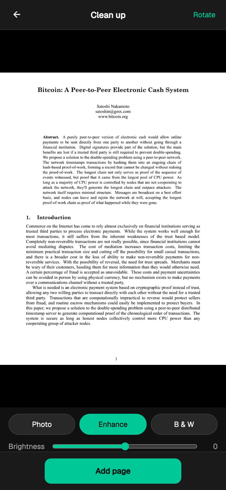
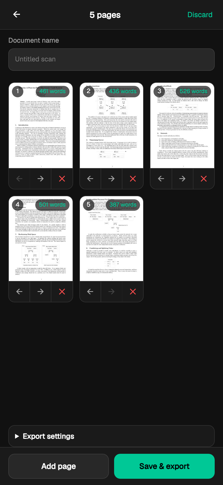
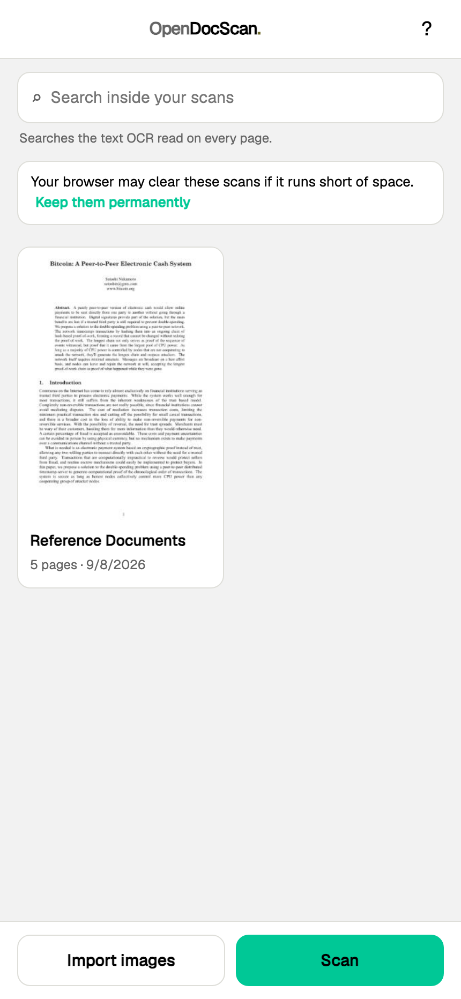
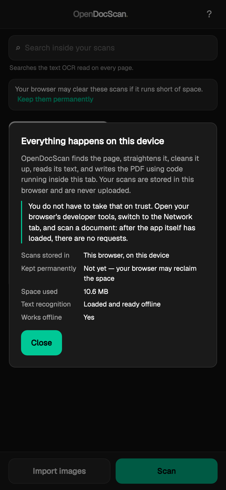

# OpenDocScan

Photograph a document, get a real scan: straightened, cleaned, and searchable.

**[opendocscan.com](https://opendocscan.com)** · **[open the scanner](https://app.opendocscan.com)**

Point a phone at a page. OpenDocScan finds the edges of the sheet, corrects the
perspective, cleans the lighting, reads the text, and writes a multi-page PDF
you can search and select from. No account, no watermark, no page limit, and
nothing to install.

Everything runs on your own device. Unlike a native scanner app, that is a claim
you can check yourself — see [Verifying it](#verifying-it).



---

## Get the app

Three ways to run it, and they are not equally finished. Read the state before
picking one.

### In your browser — ready

### → **[app.opendocscan.com](https://app.opendocscan.com)**

This is the complete product. Every feature listed below works here, on a phone,
a tablet or a laptop, in any modern browser.

On a phone it is worth adding to your home screen — **Share → Add to Home
Screen** on iOS, **⋮ → Add to Home screen** on Android. It then opens without
browser chrome, works offline, and uses the rear camera like any other app.
Nothing to install, nothing to update.

### Android — release candidate

### → **[Download the latest APK](https://github.com/OpenDocScan/opendocscan/releases/latest)**

A native build, published for testing. It is **early**: it takes a photograph,
from the camera or your photo library, as far as the scanning engine and back —
and no further. Straightening, cleaning, text recognition and PDF export are not
yet wired into it. If you want a scanner that finishes the job today, use the
browser.

To install it:

1. Download `OpenDocScan-v0.1.0-rc.1.apk` from the release page.
2. Open it. Android will warn you it came from outside the Play Store, because
   it did — allow installs from your browser or file manager when asked.
3. The build is signed with a debug key, so that warning is expected. Check the
   download against the `.sha256` published beside it if you want to be certain
   of what you have.

Needs Android 7.0 (API 24) or newer. About 48 MB, because it carries the
scanning engine compiled for three processor architectures.

### iPhone and iPad — in progress

No download yet. The build runs on both, is laid out properly for the iPad
including Split View, and passes its tests on the simulator — but handing out an
iOS build needs an Apple signing certificate, so there is no TestFlight link to
give you.

You can run it on your own device today by [building it from
source](#the-phone-app). Needs iOS or iPadOS 15 or newer.

---

## What it does

| | |
|---|---|
| Camera capture | Live preview with the detected page outlined as you move |
| Import | One image opens the corner editor; a batch is detected and added without stopping to ask |
| Edge detection | Automatic, with four draggable corners for when it gets it wrong |
| Perspective correction | Sized to the page's near edge, so nothing sharp is thrown away |
| Filters | Photo, Enhance, Black and white, plus brightness and rotation |
| Multi-page | Reorder, delete, add — no limit |
| Text recognition | English, on-device, producing an invisible selectable layer |
| Library | Stored in this browser, full-text searchable across every scan |
| Export | PDF to the share sheet, or a download |
| Offline | Works with no connection once loaded |

<table>
<tr>
<td width="33%"></td>
<td width="33%"></td>
<td width="33%"></td>
</tr>
<tr>
<td><sub>Pages, with the words read from each</sub></td>
<td><sub>The library, searchable by the text inside your scans</sub></td>
<td><sub>Where your scans live, and how to check</sub></td>
</tr>
</table>

---

## Verifying it

Most scanner apps say your documents stay private. In a native app that is a
promise you have no way to audit. Here it is something you can watch happen:

1. Open [app.opendocscan.com](https://app.opendocscan.com) and let it load.
2. Open your browser's developer tools and switch to the **Network** panel.
3. Clear the list, then scan or import a page and export a PDF.
4. Read the list. After the app itself has loaded, there is nothing in it.

Three mechanisms make that true, in order of how hard each is to subvert:

1. **The core cannot reach the network.** `docscan-wasm` has no HTTP client and
   no networking dependency. Read its `Cargo.toml`.
2. **The text recognition is vendored.** tesseract.js fetches its WASM core and
   language model from a CDN by default, which would mean a third party learning
   each time you scanned something. Every byte is served from the app's own
   origin instead — see `apps/web/vendor/tesseract/`.
3. **The service worker refuses cross-origin requests outright.** Every request
   the page makes passes through `apps/web/sw.js`, and anything bound for another
   origin is answered with a 403 rather than forwarded. A future dependency that
   tried to phone home would fail loudly instead of succeeding quietly.

The end-to-end suite asserts the same thing on every run: it records every
request the app makes while driving a complete scan and fails if one leaves the
origin. The Android build ships **without the internet permission at all**, so
that process cannot open a socket even if some future dependency tried to.

---

## How it is put together

One core, written once in Rust, compiled three ways.

```
crates/
  docscan-core        shared types and image IO
  docscan-detect      finding the page in a photograph
  docscan-transform   perspective correction
  docscan-filters     histograms and lookup tables
  docscan-ocr         text recognition glue
  docscan-pdf         PDF assembly, with an invisible text layer
  docscan-wasm        the browser boundary       (wasm32-unknown-unknown)
  docscan-ffi         the Android/iOS boundary   (flutter_rust_bridge)
apps/web              the browser app — no build step but the Rust one
app                   the Android and iOS app (Flutter)
```

No image processing is written twice, and none of it lives in Dart or
JavaScript — those layers handle the camera, the file picker and the screen, and
nothing else. The browser receives the core as WebAssembly, **138 KB over the
wire**; the phones get the same crates cross-compiled natively.

---

## Building from source

### The browser app

```sh
cd apps/web
npm install
npm run build      # compiles the Rust core to WebAssembly
npm run serve      # http://127.0.0.1:8765
```

There is no bundler. The HTML, CSS and JavaScript are served as written.

Testing a phone camera needs HTTPS, because `getUserMedia` is gated on a secure
context — `npm run serve:lan` generates a certificate for this machine's LAN
address and prints the steps to trust it. `apps/web/README.md` has the detail,
including two failure modes that look like app bugs and are not.

### The phone app

Needs the [Flutter SDK](https://docs.flutter.dev/get-started/install), the Rust
toolchain, and Xcode or the Android SDK.

```sh
cd app
flutter pub get
flutter run                        # a connected device or a running simulator
flutter build apk --release        # Android
flutter build ios --release        # iOS — needs your own signing certificate
```

The Rust core is cross-compiled automatically as part of the Gradle and Xcode
builds; there is no separate step. `app/README.md` covers the three traps that
cost real time when this was first stood up.

---

## Tests

```sh
cargo test --workspace                                    # 80, no browser
cd apps/web && npm test                                   # 4, real Chromium
cd app && flutter test                                    # 28, no device
cd app && flutter test integration_test/ -d <device-id>   # 6, on a device
```

Four suites, proving different things. Running one of them is false confidence
in a specific direction.

- **Rust** covers the arithmetic: detection, correction, the histogram filters,
  PDF assembly, the FFI boundary.
- **The browser suite** drives a real Chromium through the real UI. It draws a
  photographed page, imports it, checks the rectified result has the *sheet's*
  aspect rather than the *photo's*, exports a PDF, and parses it back for its
  page count, title, invisible-text marker and the words recognition read.
- **The Flutter host suite** covers the phone screens — every permission state,
  a cancelled pick, one bad file among good ones, and the iPad layouts driven by
  resizing the window. It proves nothing about the bridge: a library built for a
  phone cannot load on the Dart VM.
- **The integration suite** loads the real library and calls the real core. It is
  the only thing that catches a broken cross-compile, a missing ABI, or generated
  bindings that drifted from the Rust.

`apps/web/BENCHMARKS.md` covers performance, including two optimisations that
measurement rejected.

---

## Known limits

- **Text recognition is English only.** The bundled model is `eng`.
- **The invisible text layer is Latin-script only.** It uses unembedded
  Helvetica with WinAnsi encoding, so it cannot carry CJK, Cyrillic or Greek.
  Words it cannot encode are dropped from the searchable layer rather than
  mangled; the page image is unaffected.
- **The library lives in one browser.** Not in an account, not on a server, not
  on your other devices. Clearing site data clears it. The app asks for
  persistent storage and tells you whether the browser granted it.
- **HEIC cannot be decoded** by the phone builds. Capture arrives as JPEG, but a
  file picked from an iPhone's photo library may not; it surfaces as a message on
  the card, not a crash.
- **A photographed slide** from a presentation deck sometimes rectifies to the
  wrong quadrilateral. The rule that would fix it starts rejecting real receipts,
  so this is a known limit rather than a pending fix.
- **The phone apps have never taken a photograph on real hardware.** An
  emulator's camera is not worth much and the iOS Simulator has none. That is
  what the release candidate is for.

## Licence

MIT or Apache-2.0, at your option.
